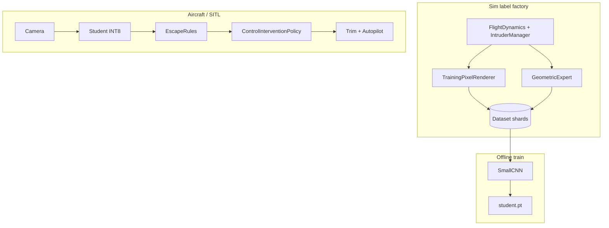

# RFC 003: Lightweight Visual Detect-and-Avoid

**Status:** Proposed (2026-06-06)  
**Author:** Lightweight DAA exploration  
**Related:** RFC 001 (ImpalaCNN harness), RFC 002 (RL fine-tune path)  
**Working directory:** `lightweight-visual-daa/`  
**Design detail:** `lightweight-visual-daa/DESIGN.md`

## Summary

Add a **decomposed, sim-supervised** visual DAA path optimized for **low-power embedded compute** (Pi-class ARM, Coral, Hailo)—not Jetson-only stacks. Training data comes from a **geometric expert** running in the existing 6-DOF simulator with the CPU pixel renderer, not from Gazebo or manual labeling.

Deploy shape:

```
Camera → threat saliency (+ optional escape hint) → fixed-wing escape rules → autopilot offsets
```

RFC 001’s end-to-end `ImpalaCNN` policy (`final_model.pt`) remains the **baseline upper bound**, not the target architecture for BVLOS embedded DAA.

## Motivation

### Problem

Fixed-wing BVLOS needs a **forward electro-optical** collision-avoidance layer that:

- Runs on **modest hardware** with a simple camera (10–15 Hz, sub-720p is acceptable).
- Handles **small, distant, cluttered** intruders (birds in ground clutter, bright-sky traffic, varied closure geometry).
- Is **trainable without** a photorealistic sim farm or RL sample-inefficiency at full-control dimensionality.

### Prior art in this repo

| Approach | Location | Limitation for embedded BVLOS |
|----------|----------|--------------------------------|
| End-to-end RL (`ImpalaCNN`) | `final_model.pt`, RFC 001 | Larger model, opaque objective, harder to shrink/validate |
| Bearing placeholder | `SimpleBearingAvoidancePolicy` | State-based, not pixel-trained |
| GPU mesh renderer | `nvdiffrast_renderer.py` | Training fidelity option, not required for label gen |

### Hypothesis (accepted for this RFC)

Collision risk appears in the **image plane** as **looming** and **bearing convergence** toward the optical center. Avoidance steers so threat pixels **drift toward FOV edges** (increasing angular separation). A sim expert with ground truth can manufacture **(frame, threat mask, escape action)** labels; a **small student network** imitates saliency (and optionally turn hint) while **escape geometry stays explicit** on device.

**Refinement over naive “stationary pixel = collision”:** treat **stationary + looming** as high risk; **drift toward center** is often stronger than stationarity alone.

## Goals

1. **Tier 0** rule baseline (optical flow + geometry) for scenario validation without ML.
2. **Tier 1** sim expert label pipeline + small CNN student (saliency / escape hint).
3. **Eval harness** comparing Tier 0, Tier 1, and `final_model.pt` on shared scenario seeds.
4. **Integration** via existing `ControlInterventionPolicy` (offset from trim, not full autopilot replacement).

## Non-goals

- Replacing PX4 / full autopilot (intervention layer only, same as RFC 001).
- Gazebo, AirSim, or photorealistic rendering for v1 labels.
- Intruder **class taxonomy** (bird vs. ultralight) in v1—saliency only.
- Distributed RL training in this repo (RFC 002 scope; not duplicated here).
- Certifying or claiming regulatory compliance for BVLOS DAA.

## Proposed design

### Architecture tiers

| Tier | Input | Processing | Output | Role |
|------|-------|------------|--------|------|
| **0** | Gray 80×60–160×128 @ 10 Hz | Sparse optical flow + rules | Turn sign, urgency | Sanity check, negative control |
| **1** | Gray/RGB 96×160 @ 10 Hz | Small CNN (~3–8M params) | Threat heatmap ± escape hint | **Target deploy** |
| **2** | RGB 128×128 @ 10+ Hz | `ImpalaCNN` (RFC 001) | Full `[T, ail, ele, rud]` | Baseline comparison |



### Geometric expert (label factory)

Deterministic policy using sim ground truth—not visible to the student at deploy time.

**Per intruder in forward camera:**

1. Project to image `(u, v)`, range `R`, blob radius `r_px`.
2. Compute `(du/dt, dv/dt)` and looming proxy `−(dR/dt)/R` or `(dr_px/dt)/r_px`.
3. Threat score `S = α·loom+ + β·conv+ + γ·exp(−||(u,v)−c||/σ)` where `conv+` rewards motion toward optical center.

**Expert action:** coordinated turn (respecting max bank / rate limits) to push highest-`S` centroid toward the **nearest image edge**; wings-level when `S < S_min`.

**Logged per frame** (see `lightweight-visual-daa/DESIGN.md`):

- `image` (uint8)
- `threat_mask` (float32, soft rasterized projection)
- `expert_action` (aileron, elevator, …)
- `escape_hint` (turn_sign, urgency)
- optional `optical_flow` ground truth

### Student model (Tier 1)

**Preferred v1:** heatmap head only; escape rules run on device (same logic as expert, on predicted centroid).

```python
@dataclass
class LightweightDAAConfig:
    input_shape: tuple[int, int, int] = (96, 160, 1)  # H, W, C gray
    inference_hz: float = 10.0
    mask_threshold: float = 0.5
    max_bank_deg: float = 35.0
```

**Optional v2 head:** add `urgency` (regression) + `turn_sign` (3-class) if rule-only escape from noisy masks underperforms.

**Loss:**

```
L = λ_mask · Dice(pred, gt_mask) + λ_neg · empty_frame_penalty
  + optional: λ_turn · CE(turn_sign) + λ_urg · MSE(urgency)
```

Hard-negative frames (clear sky, no intruder within sensor range) are **required** to limit false swerves.

### Escape rules on device (shared Tier 0 / Tier 1)

Given binary/soft mask above threshold:

1. Centroid `(ū, v̄)` and optional urgency.
2. `turn_sign = sign(ū − cx)` (push threat off boresight); break ties with larger mask extent toward left/right edge.
3. Map to **aileron offset** with rate limits; coordinated elevator from trim tables.
4. Inject via `ControlInterventionPolicy` blend (mirror RFC 001 `ModelPolicy` modes).

No 3D tracker or Kalman filter required on aircraft for v1.

### Sim and rendering (no Gazebo)

Reuse existing assets:

| Component | Path |
|-----------|------|
| Physics + intruders | `simulator/dynamics.py`, `simulator/intruders.py` |
| Label camera | `simulator/policy/training_render.py` (`TrainingPixelRenderer`) |
| Fast blob camera (ablation) | `simulator/policy/rendering.py` (`CPUPixelRenderer`) |
| Scenarios | `configs/scenarios/head_on.yaml`, `crossing.yaml`, `overtaking.yaml`, `multi_intruder.yaml` |
| Episode driver | extend `simulator/gym_env.py` or new `lightweight-visual-daa/label_generator.py` |

**Domain randomization (minimum):** `time_of_day`, `weather_fog`, exposure/gamma/JPEG noise, intruder color/contrast, spawn geometry, optional camera pitch misalignment.

### Compute budget (targets)

| Platform | Resolution | Rate | Model |
|----------|------------|------|-------|
| Pi 4 / CM4 | 96×128 gray | 5–10 Hz | ~3–8M param CNN or Tier 0 only |
| Coral / Hailo | same | 15–30 Hz | INT8 student |
| Jetson (reference) | 128×128 RGB | 15+ Hz | Tier 2 baseline |

Horizon **ROI crop** (±15° band) is in scope to cut clutter and FLOPs.

## Public interfaces (proposed)

### Label generation

```bash
python -m lightweight_visual_daa.label_generator \
  --scenario configs/scenarios/head_on.yaml \
  --episodes 1000 \
  --seed 0 \
  --output data/daa_labels/head_on/
```

### Training (Tier 1)

```bash
python -m lightweight_visual_daa.train_student \
  --data data/daa_labels/ \
  --output checkpoints/student_v1.pt
```

### Evaluation

```bash
python -m lightweight_visual_daa.run_eval \
  --tier 1 \
  --checkpoint checkpoints/student_v1.pt \
  --baseline final_model.pt \
  --scenarios configs/scenarios/ \
  --episodes 100 \
  --seed 42
```

### SITL / sim closed loop

```bash
python run_px4_bridge.py \
  --policy lightweight:checkpoints/student_v1.pt \
  --policy-mode offset
```

(`lightweight:` prefix or separate flag—implementation detail in Phase 3.)

## Metrics and acceptance criteria

Report per scenario and seed batch:

| Metric | Definition |
|--------|------------|
| **Collision rate** | Fraction of episodes with ownship–intruder contact |
| **Min separation** | Closest approach distance (m) |
| **CPA time** | Time to closest point of approach |
| **False swerve rate** | Maneuvers when no intruder within `R_warn` |
| **Time-to-escape** | Frames from first `S > S_thresh` to bearing-divergence sign flip |
| **Saturation** | Fraction of steps at max bank / surface deflection |
| **Latency** | Camera frame to control injection (ms), p95 on target hardware |

**Phase 2 exit (Tier 1 vs Tier 0):** student matches or beats Tier 0 on collision rate across four standard scenarios with ≤2× false swerve rate of expert on clear-sky negatives.

**Phase 4 exit (vs baseline):** student within **10% collision rate** of `final_model.pt` on shared seeds **or** equal collision rate at **≥5× lower** inference cost on Pi reference board.

## Implementation phases

| Phase | Scope | Exit criteria |
|-------|-------|---------------|
| **0** | RFC + `GeometricExpert` + mask logging on `head_on` | 100 episodes write valid shards; masks align with projected intruder |
| **1** | Tier 0 optical-flow rules in sim loop | Closed-loop avoidance on `head_on` + `crossing`; metrics CSV |
| **2** | Label generator all scenarios + student v1 train | Student beats Tier 0 on collision rate; eval CLI |
| **3** | `LightweightDAAPolicy` → `ControlInterventionPolicy` | Closed loop in sim + optional PX4 bridge flag |
| **4** | Domain randomization + hard negatives + INT8 export | False swerve gate; latency doc for Pi/Coral |
| **5** | CI smoke | Label gen 10 ep + student inference smoke test |

### File plan (`lightweight-visual-daa/`)

| File | Purpose |
|------|---------|
| `expert_policy.py` | Threat score, expert action, escape hint |
| `optical_flow_baseline.py` | Tier 0 rules-only policy |
| `label_generator.py` | Batch sim episodes → dataset |
| `dataset.py` | Shard I/O, augmentations |
| `model.py` | Small CNN architecture |
| `train_student.py` | Imitation training loop |
| `run_eval.py` | Compare tiers + baseline |
| `policy.py` | `LightweightDAAPolicy` for sim integration |

## Relationship to RFC 001 / 002

| RFC | Relationship |
|-----|--------------|
| **001** | Reuse `ControlInterventionPolicy`, `actions.py`, renderers, `run_policy_eval.py` patterns; `final_model.pt` = Tier 2 baseline |
| **002** | No RL fine-tune of ImpalaCNN required; optional future **distillation** from `final_model.pt` into student is out of scope for v1 |

## Open questions

1. **Single frame vs. two-frame input** for looming without explicit flow on device?
2. **Horizon ROI** default: fixed crop vs. learned attention?
3. **Multi-intruder:** max-`S` only vs. merged mask of top-k threats?
4. **Throttle intervention:** expert holds trim throttle only, or allow speed changes under high urgency?
5. **Real camera transfer:** minimum real-world collection needed, or sim-only v1 acceptable for repo scope?
6. **Policy rate vs. physics rate:** 10 Hz DAA with hold between 100 Hz physics steps (likely yes—align with RFC 001 Q3)?

## Decision log

| Date | Decision | Rationale |
|------|----------|-----------|
| 2026-06-06 | Decomposed saliency + rules over end-to-end RL for embedded target | Interpretability, smaller model, sim expert labels |
| 2026-06-06 | Reuse `TrainingPixelRenderer`, not Gazebo | Already in repo; fast batch labeling |
| 2026-06-06 | Threat = looming + convergence, not stationarity alone | Reduces cloud/glare false positives |
| 2026-06-06 | Keep `final_model.pt` as baseline, not migration path | Different optimization point on compute/ops curve |

## References

- `lightweight-visual-daa/README.md` — exploration notes and tier overview
- `lightweight-visual-daa/DESIGN.md` — label schema, threat math, losses
- `docs/rfcs/001-pytorch-policy-integration.md` — policy harness
- `docs/rfcs/002-rl-training-path.md` — RL training path (separate track)
- Optical collision / tau avoidance literature (image-plane looming and bearing rate)
