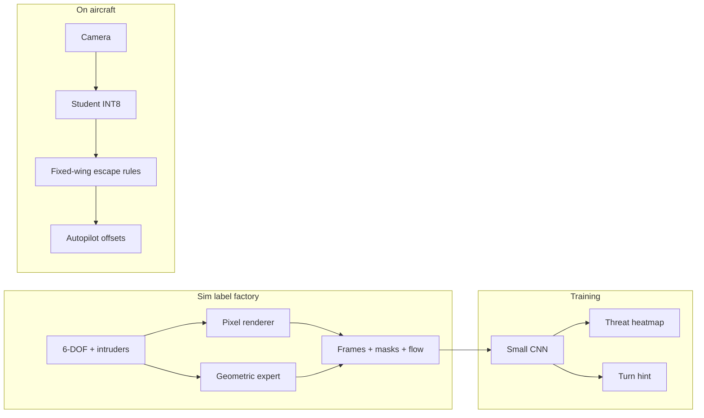

# Lightweight Visual Detect-and-Avoid

**RFC:** [`docs/rfcs/003-lightweight-visual-daa.md`](../docs/rfcs/003-lightweight-visual-daa.md)

Exploration of a **computationally cheap, camera-only** DAA stack for fixed-wing BVLOS flight. The goal is to run on low-power compute (Pi-class, Coral/Hailo, or a modest ARM SoC)—not a Jetson-only pipeline—and to avoid a heavy Gazebo/photorealistic sim stack for training data.

## Core hypothesis (boiled down)

1. Find pixels that belong to other flying objects (or at least pixels that *behave* like collision threats).
2. Steer so those pixels **drift toward the edge of the image**, not toward the center—and not **linger stationary** while growing (head-on looming).

You do **not** necessarily need full 3D state estimation or explicit relative-velocity vectors on the aircraft. You need **image-plane behavior** that correlates with collision risk, plus a policy that increases **angular separation**.

This directory holds design notes, experiments, and (eventually) a sim-backed label generator built on the parent repo’s existing physics and pixel renderers.

## Relationship to existing work in this repo

The parent simulator already has most of what this approach needs:

| Asset | Location | Relevance |
|-------|----------|-----------|
| 6-DOF ownship + intruder physics | `simulator/dynamics.py`, `simulator/intruders.py` | Scenario diversity without Gazebo |
| CPU pixel camera (128², 90° FOV) | `simulator/policy/training_render.py` | Fast label generation |
| Lighter blob renderer | `simulator/policy/rendering.py` | Even cheaper batch rendering |
| Gym-style loop | `simulator/gym_env.py` | Episode driver for expert + logging |
| Prior end-to-end RL policy | `final_model.pt`, `ImpalaCNN` | Heavier path; useful baseline, not the target |

The **previous prototype direction** (pixels → ImpalaCNN → full flight controls via RL) is valid but tends to be **heavier to train, harder to interpret, and harder to shrink** for embedded deploy. The hypothesis here is a **decomposed, imitation-friendly** pipeline with a clearer physical meaning.

## What you got right

### 1. “Roll threat pixels off the screen” is real collision geometry

In a forward camera, **collision course** shows up as:

- **Looming**: the threat subtends a growing angle (expansion in the image).
- **Bearing convergence**: the threat’s **centroid drifts toward the optical center** (or stays centered while looming—classic head-on).
- **Safe pass**: the threat drifts **toward a FOV edge** with modest looming, or crosses the FOV without centering.

Aviation and robotics literature often calls this **optical collision detection** or **tau-based** avoidance. Your “move pixels sideways/up/down off the frame” rule is the same idea as **maximizing the angular rate of the line-of-sight** away from the threat—without naming it.

### 2. A deterministic “game” expert is an excellent label factory

Using a script that has **ground truth** (intruder positions, velocities, CPA) to steer the ownship while logging **what the camera saw** is one of the best ways to get training data at scale:

- No human labeling.
- No Gazebo if you keep the renderer simple (this repo already does).
- Perfect supervision for **optical flow**, **threat heatmaps**, **segmentation masks**, and **expert turn commands**.

The expert does not need to be optimal—it needs to be **consistent** and **physically plausible** for fixed-wing rates.

### 3. You may not need full vector fusion on the edge device

On deploy, a useful decomposition is:

```
Camera → [threat/saliency] → [escape direction + urgency] → [fixed-wing autopilot offsets]
```

Ground-truth vectors in sim **supervise** the middle layers; the deployed model never runs a full tracker + Kalman stack unless you want one for logging.

## What to refine in the hypothesis

### “Stationary in the image = collision”

**Partially true, context-dependent.**

| Situation | Image behavior | Risk |
|-----------|----------------|------|
| Head-on, similar speed | Blob **fixed near center**, **strong looming** | High |
| Distant crossing traffic | Blob moves across FOV | Lower if not centering |
| Ownship turn toward threat | Blob moves to center **without** high range rate | Can look like collision briefly |
| Cloud / glare patch | Stationary, no consistent looming | False positive |

**Better rule**: treat **stationary + looming** (growth) as high risk; treat **stationary without looming** as weak evidence. Lateral drift toward center is often a **stronger** signal than absolute stationarity.

### “Identify pixels of other flying objects”

Full **instance segmentation** of birds vs. ultralights vs. drones is **nice but not required** for first avoidance. What matters is **collision-relevant saliency**:

- Regions with **anomalous motion** relative to the dominant background (sky/ground optical flow).
- Regions with **positive divergence** (looming) in the forward hemisphere.

A tiny network can predict a **threat heatmap** supervised from sim projections, without class labels. Class labels help later for logging (“bird vs. manned”) but not for the first swerve.

### Challenge mapping

| Your concern | Practical response |
|--------------|-------------------|
| Which pixels are intruders? | Sim gives masks; train saliency/flow head; optional tiny detector |
| Relative trajectories | Supervise with sim optical flow; deploy with flow + looming heuristics |
| Vectors must not converge | Expert maximizes **image-plane angular rate** of threat away from center |
| Lightweight compute | 64–160 px gray, 5–15 Hz, small CNN or even flow-only MVP |
| Training data volume | Procedural intruders + domain randomization in existing sim |
| Gazebo | Avoid; extend `TrainingPixelRenderer` / `IntruderManager` instead |

## Recommended architecture (three tiers)

### Tier 0 — No ML sanity check (days)

Downsampled grayscale, sparse optical flow (e.g. Lucas–Kanade on a grid):

1. Estimate dominant background flow (sky vs. ground halves).
2. Flag clusters with **flow inconsistent with background** + ** toward-center drift** or **divergence**.
3. Command turn: **away from weighted centroid** of flagged pixels (rule-based).

**Purpose**: validate sim scenarios and metrics before any training. Often surprisingly good for **single prominent intruder** cases.

### Tier 1 — Lightweight learned saliency (target deploy shape)

**Input**: 96×160 grayscale (or RGB), 10 Hz  
**Output**: threat heatmap **or** compact `(cx, cy, urgency, suggested_turn_sign)`  

**Training**:

1. Run geometric **expert policy** in sim (see below).
2. Log `(frame, threat_mask, expert_aileron/elevator, optical_flow_gt)`.
3. Train small encoder (MobileNetV2-0.35-scale or custom 3-block CNN) with BCE/Dice on mask + regression on turn.

**Deploy**: heatmap → 10 lines of geometry → roll/pitch offset into existing autopilot (similar to `ControlInterventionPolicy` in the parent sim).

### Tier 2 — End-to-end control (what you already prototyped)

Pixels → CNN → controls. Keep as **upper bound baseline**, not the default path for “lightweight.”



## Geometric expert policy (the “game” script)

This is the label generator you described—deterministic, uses sim ground truth, outputs what the **student should have seen**.

**Per frame, for each intruder visible in the forward camera:**

1. Project to image `(u, v)` and range `R`.
2. Compute image-plane velocity `(du, dv)` from projection (exact in sim).
3. Compute **looming** proxy: `d(log subtended_angle)/dt` or `−dR/dt / R`.
4. Compute **bearing error** relative to optical center: `(u − cx, v − cy)`.

**Threat score** (example):

```
T = w1 * loom+ + w2 * exp(−|u−cx|/σ) + w3 * 1[dR/dt < 0]
```

**Expert turn** (fixed-wing friendly):

- If `T > threshold`: apply **coordinated turn** whose sign pushes the **highest-T centroid** toward the **nearest image edge** (choose left vs. right by which increases `|u − cx|` fastest given bank limits).
- Respect max bank / pitch rate from `generic_uav.yaml`.

Log:

- RGB or gray frame
- Binary or soft **threat mask** (rasterized projected mesh / blob)
- `(du, dv)` per pixel or per threat
- Expert `(aileron, elevator)` or `(turn_rate, pitch_rate)`

That dataset supports **imitation** without RL sample inefficiency.

## Training data diversity (without Gazebo)

Use procedural variation on existing systems:

| Knob | Where |
|------|--------|
| Intruder type / size / closure rate | `IntruderManager`, configs |
| Spawn geometry (head-on, crossing, overtaking) | `configs/scenarios/*.yaml` |
| Background (time of day, fog) | `TrainingRenderConfig` |
| Appearance (gray blob vs. mesh, bird-like speck) | renderer extensions |
| Camera noise, blur, exposure | post-process on logged frames |
| Ownship trim / speed | `TrainingFidelityConfig` |

Scenarios to prioritize: **head-on**, **crossing**, **overtaking**, **intruder in ground clutter** (low altitude, blob above horizon line), **bright sky intruder** (high contrast, small blob).

## Model and compute budget (order of magnitude)

| Platform | Realistic target |
|----------|------------------|
| Raspberry Pi 4 / CM4 | 96×128 gray, 5–10 Hz, ~3–8M param CNN or flow+rules |
| Google Coral / Hailo | Same model INT8, 15–30 Hz |
| Jetson Nano class | Headroom for dual-head (saliency + flow) |

Avoid 128×128 RGB @ 30 Hz with a 30M-param detector as v1. **Start smaller**; intruders at 500 m may be **3–8 pixels**—consider a **narrow FOV telephoto** or **ROI crop** around horizon band (reduces compute and clutter).

## Metrics (before touching hardware)

Run in parent sim with logged episodes:

- **Min separation** / CPA time
- **Collision rate** by scenario seed
- **False swerve rate** (no intruder within X m)
- **Time-to-discard**: frames from first visible threat to bearing rate sign flip (angular escape)
- **Control saturation** (fixed-wing feasibility)

Compare Tier 0 rules vs. Tier 1 student vs. `final_model.pt` baseline on the same seeds.

## Suggested next steps in this directory

1. **`DESIGN.md`** — expert policy math and label schema (companion to this README).
2. **`expert_policy.py`** — geometric expert using sim ground truth (Tier 0/1 labels).
3. **`label_generator.py`** — batch episode runner over `TrainingPixelRenderer` + scenarios.
4. **`baseline_optical_flow.py`** — Tier 0 rule-only avoidance for comparison.
5. **Small student model** — only after label pipeline proves useful diversity.

## Bottom line

Your instinct is sound: **use a simple sim “game” with a geometric expert to manufacture labels**, and **train a small model to predict threat pixels / escape direction** rather than jumping straight to heavy end-to-end RL in a Gazebo-class stack.

The main refinements:

1. Frame risk as **looming + bearing convergence**, not stationarity alone.
2. **Decompose** (saliency → turn rules) for interpretability and embedded size.
3. **Reuse this repo’s CPU renderer and intruder system**—you already avoided Gazebo.
4. Keep **`final_model.pt`** as a baseline, not the architecture you optimize for lightweight BVLOS.

---

Questions or experiments to run next: pick one scenario (`head_on.yaml`) and implement the expert + mask logger; compare Tier 0 optical flow vs. expert labels on 100 seeds.
